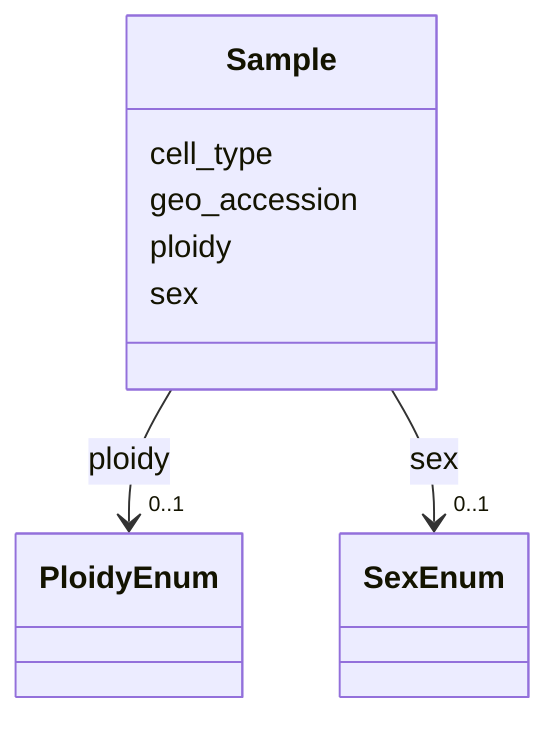

# Class: Sample


URI: [MySchema:Sample](https://w3id.org/MySchemaSample)





<!-- no inheritance hierarchy -->


## Slots

| Name | Cardinality and Range | Description | Inheritance |
| ---  | --- | --- | --- |
| [geo_accession](geo_accession.md) | 1 <br/> [String](String.md) |  | direct |
| [sex](sex.md) | 0..1 <br/> [SexEnum](SexEnum.md) |  | direct |
| [ploidy](ploidy.md) | 0..1 <br/> [PloidyEnum](PloidyEnum.md) |  | direct |
| [cell_type](cell_type.md) | 0..1 <br/> [String](String.md) |  | direct |


## Identifier and Mapping Information


### Schema Source


* from schema: https://w3id.org/MySchema


## Mappings

| Mapping Type | Mapped Value |
| ---  | ---  |
| self | MySchema:Sample |
| native | MySchema:Sample |


## LinkML Source

<!-- TODO: investigate https://stackoverflow.com/questions/37606292/how-to-create-tabbed-code-blocks-in-mkdocs-or-sphinx -->

### Direct

<details>
```yaml
name: Sample
from_schema: https://w3id.org/MySchema
slots:
- geo_accession
- sex
- ploidy
- cell_type

```
</details>

### Induced

<details>
```yaml
name: Sample
from_schema: https://w3id.org/MySchema
attributes:
  geo_accession:
    name: geo_accession
    examples:
    - value: GSM2516206
    from_schema: https://w3id.org/MySchema
    rank: 1000
    identifier: true
    alias: geo_accession
    owner: Sample
    domain_of:
    - Sample
    range: string
  sex:
    name: sex
    examples:
    - value: n/a
    from_schema: https://w3id.org/MySchema
    exact_mappings:
    - PATO:0001894
    rank: 1000
    alias: sex
    owner: Sample
    domain_of:
    - Sample
    range: sex_enum
  ploidy:
    name: ploidy
    examples:
    - value: disomic
    from_schema: https://w3id.org/MySchema
    exact_mappings:
    - PATO:0001374
    rank: 1000
    alias: ploidy
    owner: Sample
    domain_of:
    - Sample
    range: ploidy_enum
  cell_type:
    name: cell_type
    examples:
    - value: in vitro differentiated cells
    from_schema: https://w3id.org/MySchema
    exact_mappings:
    - EFO:0000324
    rank: 1000
    alias: cell_type
    owner: Sample
    domain_of:
    - Sample
    range: string

```
</details>